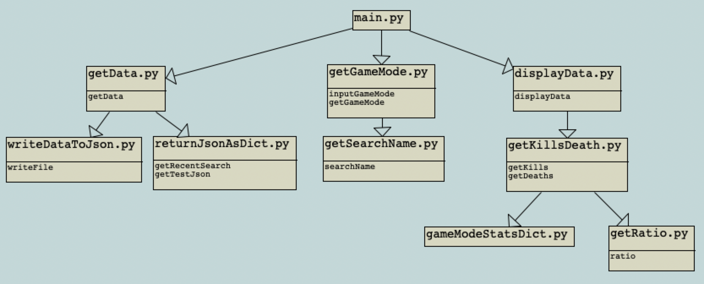

# Architecture

> Looking for our Retrospective output? 
> [It's here (via Teams)](https://teams.microsoft.com/l/file/49ABE7D5-C95D-465B-B8ED-63E200225C80?tenantId=6e725c29-763a-4f50-81f2-2e254f0133c8&fileType=xlsx&objectUrl=https%3A%2F%2Fgla.sharepoint.com%2Fsites%2Fmsteams_19d476-GroupFour%2FShared%20Documents%2FGroup%20Four%2FGroup4_Retrospective.xlsx&baseUrl=https%3A%2F%2Fgla.sharepoint.com%2Fsites%2Fmsteams_19d476-GroupFour&serviceName=teams&threadId=19:6645007512514573bea2e0363765e6e2@thread.tacv2&groupId=a4a306c3-e31e-48f6-9eb9-f1ee4d95eb4b)

While our program doesn't actually utilise Classes, we have created a diagram to outline the different files and respective modules which are called. We use a format similar to UML to show this, but instead the heading for each 'box' is the Python file and then underneath are the functions that are present and can be called.

Classes aren't used as we decided to not go down the Object-Oriented route. We implemented our solution to the problem outlined in our [Introduction](../README.md) on a procedural basis.

Our program starts by running **main.py**, which will import the other required function files and then call our **getData** function and assign the result to the variable **allPlayerData**. Inside this call is a user input requirement to retrieve the Player's username. This is just handled as a **String**. There is also the option to load directly from an existing **JSON** file (previously searched Player data). For either selection, the full player data returned to the variable is made up of **JSON**.

Next, we call **getGameMode** and assign the result to variable **selectedGame**. This takes a user input as returns it as a **String**.

Finally, using the above two variables which have now been assigned their relevant data, the program makes a call to **displayData**. This function will retrieve numerous bits of Player data the user is specifically looking for. This will then be printed and displayed to the console as a **String**.

### Diagram

As our program is procedural, these functions run left to right - starting with getData.py.

